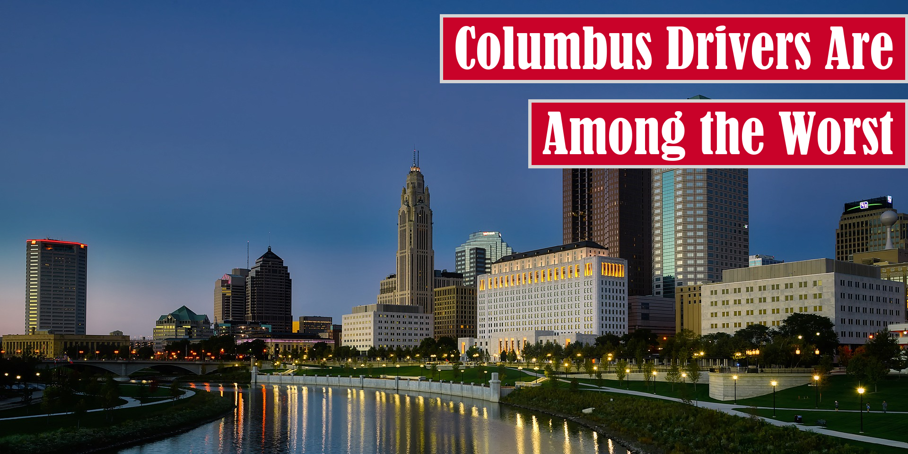

# Sample Image Titles

In this archive, I'll share a series of samples that are output by this program. That said,
here's a quick video overview:


## Default Behavior

The following image is an example of the default behavior of this program as of v1.8.0:


Here's the command that would generate this image:

```shell script
image-titler
```

## Logo Behavior

The following image is an example of the behavior when the script is provided a logo as of 1.8.0:


When using a logo, title background color is generated automatically. Here's another example:


Here's the command that would generate these images:

```shell script
image-titler -l "path/to/logo"
```

# Tier Behavior

The following image is an example of the behavior when the premium subscription tier is applied to the logo as of 1.8.0:


To generate an image like this, use the following command:

```shell script
image-titler -r premium
```

In addition, the script supports a free tier as well:



To generate an image like this, use the following command:

```shell script
image-titler -r free
```