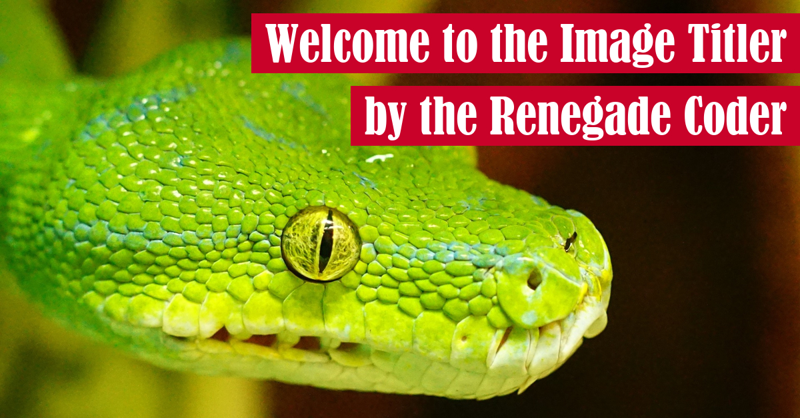
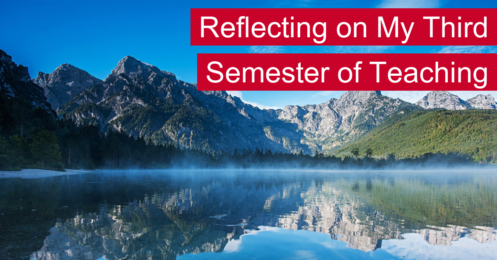

# Sample Image Titles

In this archive, I'll share a series of samples that are output by this program. That said,
here's a quick video overview:


## Default Settings

The following image is an example of the default behavior of this program as of 2.2.0:



Here's the command that would generate this image:

```shell script
image-titler
```

## Add a Custom Logo (--logo)

The following image is an example of the behavior when the script is provided a logo as of 1.8.0:


When using a logo, title background color is generated automatically. Here's another example:


Here's the command that would generate these images:

```shell script
image-titler -l "path/to/logo" -p "path/to/image"
```

## Add a Custom Border (--tier)

The following image is an example of the behavior when the premium subscription tier is applied to the logo as of 1.8.0:


To generate an image like this, use the following command:

```shell script
image-titler -r premium -p "path/to/image"
```

In addition, the script supports a free tier as well:


To generate an image like this, use the following command:

```shell script
image-titler -r free -p "path/to/image"
```

## Change the Default Font (--font)

In v2.1.0, we introduced custom font support:



To generate an image like this, use the following command:

```shell script
image-titler -f "arial.ttf" -p "path/to/image"
```

## Change the Default Size (--size)

In v2.3.0, we introduced custom size support. For example, the following image was
generated in the YouTube size (1280, 720):


To generate an image like this, use the following command:

```shell
image-titler -s YouTube -p "path/to/image"
```
